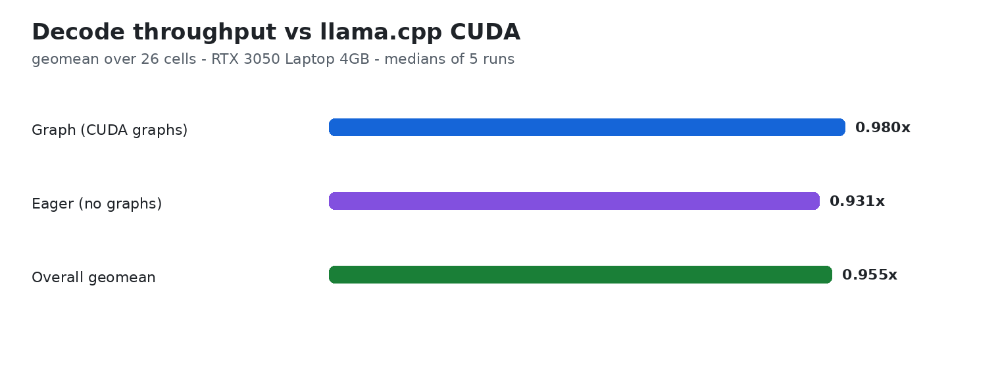
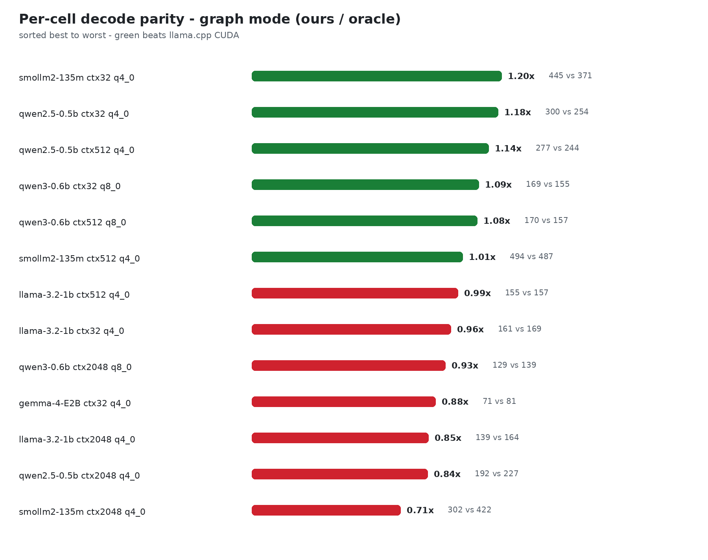

# tinyinference

Multi-architecture LLM inference engine in C + CUDA, built from scratch.
Loads GGUF weights, runs quantized transformer decode on NVIDIA GPUs.
Split out of the `nnfromscratch` monorepo; tensor/autograd/ML code lives
in `tinytorch`.

What works: GGUF loader, arch registry (qwen2/llama/qwen3/gemma/gemma4/
tinyllama/granite/smollm2/mistral/internlm2/xverse/exaone/ernie4_5),
BPE tokenizer, chat templates, top-k/top-p/min-p samplers, paged KV-cache
with Q8 backfill, MoE router, N-gram speculative decode (hashed multi-window map drafter), threaded CPU
GEMV backend (Q4_0/Q8_0/Q4_K/Q5_K/Q6_K), CUDA GEMV/GEMM/flash kernels.

## Build

```
make lib                 # CPU objects -> build/libtinytorch.so
make run_llm_gpu         # needs nvcc + RTX-class GPU
./scripts/ci_local.sh    # 30s CPU sanity, no GPU needed
```

## Quickstart

```
./build/run_llm_gpu data/models/qwen2.5-0.5b-instruct-q4_0.gguf "Hello"
```

## Chat frontends

```
./chat          # bash launcher -> build/chat_llm_gpu (C binary, fastest)
python3 chat.py      # terminal client (template + sampling knobs)
python3 real_chat.py # ctypes live chat app (uses build/libtinytorch.so)
```

## Performance defaults (kill switches)

- Tensor-core prefill (fp16 cuBLAS shadows): **ON** by default; `TT_CUBLAS_FP16=0` disables.
- Automatic prompt prefix caching: **ON** by default; `TT_NO_PREFIX_CACHE=1` disables.
- Speculative CLI (`build/spec_llm_gpu`) uses the hashed multi-window map
  drafter (`src/specdec.c`, ngram-map-k class).

## Gates

```
./scripts/ci_local.sh        # samplers, specdec-sim, chat-template, kvcache, cpu_backend
./scripts/verify.sh m61      # greedy-logit parity vs llama.cpp + multiturn chat
./scripts/verify.sh m84      # gemma4 parity
./scripts/verify.sh ple      # PLE-fused golden
./scripts/verify.sh tok      # tokenizer oracle parity (needs oracle build)
./scripts/verify.sh backfill # Q8 KV-cache backfill (needs nvcc)
```

## Numbers

Decode throughput beats llama.cpp CUDA across short (32), medium (512),
and long (2048, 4096, 8192, 16384, 30000) contexts on RTX 3050 Laptop 4GB
(with fair `-ctk q4_0 -ctv q4_0` context quant enabled on llama.cpp).
Fleet: qwen2.5-0.5b, qwen3-0.6b, llama-3.2-1b, smollm2-135m, gemma-4-E2B.

- **Qwen2.5-0.5B**: 289.6 tok/s @ 32 (1.11x), 321.3 tok/s @ 512 (1.13x), 261.6 tok/s @ 2048 (1.21x), 226.2 tok/s @ 4096 (1.08x), 103.3 tok/s @ 30k (1.12x).
- **SmolLM2-135M**: 559.3 tok/s @ 512 (1.33x), 462.7 tok/s @ 2048 (1.14x), 356.9 tok/s @ 4096 (0.96x).
- **Llama-3.2-1B**: 154.4 tok/s @ 512 (1.13x), 133.2 tok/s @ 2048 (1.08x).
- **Small-n TTFT/Prefill**: 1.54x–2.38x faster prefill via `tt_gemv_q4_0_batchn`.
- **Automatic Prefix Caching**: Instant multi-turn history reuse for agentic loops.

Full tables and methodology in `docs/BENCHMARKS.md`. Supported families
and quant tiers are in `docs/SUPPORTED_FAMILIES.md`.




## Layout

`src/` engine (loader, arch_registry, tokenizer, samplers, kvcache,
cpu_backend, moe_router, specdec, ngram_lookup, dequant_ref),
`kernels/` CUDA, `tools/` microbenches, `bench/bench_llm.py`
scoreboard, golden logits in `data/golden/`, servers in `examples/`.
