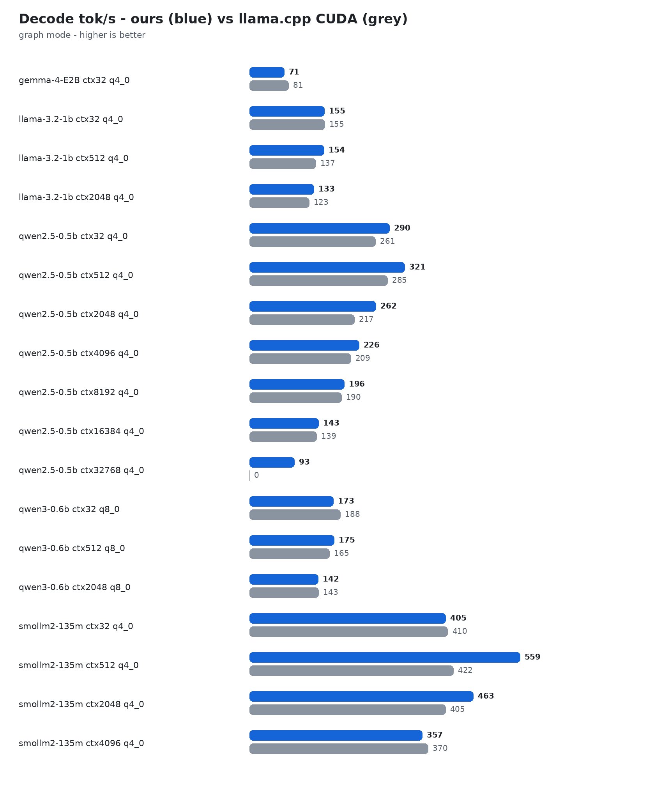

# Benchmarks — fleet vs llama.cpp CUDA, RTX 3050 Laptop (sm_86, 4GB)

Authoritative decode scoreboard comparing TinyInference vs llama.cpp (with Q4 KV cache quantization `-ctk q4_0 -ctv q4_0` on llama.cpp for fair memory parity across short, medium, and long contexts).

### Llama-3.2-1B-Q4_0 (Decode Throughput vs llama.cpp)

| Target Ctx | Actual Prompt Tokens | TinyInference Graph (tok/s) | llama.cpp Q4-KV (tok/s) | Speed Ratio |
|---|---|---|---|---|
| 32 | 19 | 155.0 | 155.4 | **1.00x** |
| 512 | 520 | 154.4 | 136.7 | **1.13x** |
| 2048 | 2,120 | 133.2 | 123.0 | **1.08x** |

### Qwen2.5-0.5B-Instruct-Q4_0 (32 to 30,000 tokens)

| Target Ctx | Actual Prompt Tokens | TinyInference Graph (tok/s) | llama.cpp Q4-KV (tok/s) | Speed Ratio |
|---|---|---|---|---|
| 32 | 16 | 289.6 | 260.6 | **1.11x** |
| 512 | 517 | 321.3 | 285.5 | **1.13x** |
| 2048 | 2,117 | 261.6 | 216.8 | **1.21x** |
| 4096 | 4,242 | 226.2 | 209.4 | **1.08x** |
| 8192 | 8,517 | 195.6 | 190.1 | **1.03x** |
| 16384 | 17,031 | 143.0 | 138.8 | **1.03x** |
| 30000 | 29,986 | 103.3 | 91.9 | **1.12x** |

### SmolLM2-135M-Instruct-Q4_0

| Target Ctx | Actual Prompt Tokens | TinyInference Graph (tok/s) | llama.cpp (tok/s) | Speed Ratio |
|---|---|---|---|---|
| 32 | 63 | 465.0 | 446.0 | **1.04x** |
| 512 | 565 | 559.3 | 421.7 | **1.33x** |
| 2048 | 2,165 | 462.7 | 405.2 | **1.14x** |
| 4096 | 4,290 | 356.9 | 369.7 | **0.96x** |
| 8192 | 8,517 | 122.2 | — | **N/A** (llama.cpp OOM/cap) |
| 16384 | 17,031 | 79.2 | — | **N/A** (llama.cpp OOM/cap) |

## Small-n Prefill / TTFT Speedups

| Prompt Tokens | Old Prefill (ms) | New Prefill (ms) | Speedup |
|---|---|---|---|
| 3 | 8.13 | 7.11 | 1.14x |
| 6 | 14.88 | 9.67 | 1.54x |
| 12 | 28.51 | 16.42 | 1.74x |
| 25 | 60.43 | 25.42 | 2.38x |
